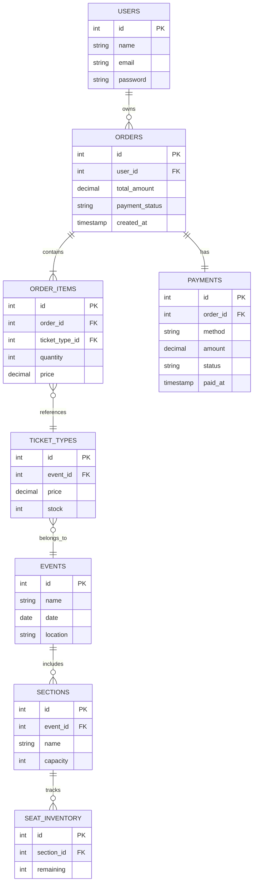

# Ticketing Website  
**Team:** AIVAF  
**Members:** 陳瑋柔、趙宇玄、楊晉有、塗晉維、曾世傑、黃炯睿  
**Document:** Project Specification (Basic Version – Deliverable Oriented)  
**Last Update:** 2025-10-31  

---

## 1. 專案概述（Project Overview）  

**Ticketing Website** 是一個活動票券販售與座位選擇平台。  
使用者可瀏覽活動、登入會員、選擇座位並完成付款；  
後台（Admin CMS）提供營運人員維護公告與活動資料。  

本文件為 **基礎版開發規格（Basic Version Specification）**，  
以「行動導向」格式撰寫，明確說明每位組員的開發目標與交付內容。  
MVP 預計於 **2025/12/10** 完成。  

---

## 2. 系統架構（System Architecture）  

| 層級 | 模組 | 說明 |
|------|------|------|
| 前端層（Frontend Layer） | HomePage、Product / Event、Member | 提供使用者瀏覽與互動介面。 |
| 交易層（Transaction Layer） | Checkout、Checkout Database、Payment、Seat Selection | 處理選位、結帳與金流。 |
| 後台層（Admin Layer） | Admin CMS | 管理公告與活動內容。 |

---

## 3. 模組任務說明（Module Responsibilities）  

---

### 3.1 HomePage（負責：陳瑋柔）  
**Goal：** 建立首頁介面，整合主要活動入口與公告資訊。  
**Deliverables：**  
- 設計導覽列（Navigation Bar）與輪播圖（Carousel）。  
- 建立公告區與精選活動展示區。  
- 串接後台公告資料（Admin CMS）。  
- 完成首頁導向連結至活動與登入頁面。  
**Deliverable Format：** 完成首頁前端頁面（HTML / React / CSS），並可正常導向其他頁面。  

---

### 3.2 Product / Event（負責：趙宇玄、楊晉有）  
**Goal：** 建立活動清單與詳細頁，顯示票種與剩餘數量。  
**Deliverables：**  
- 實作用戶可瀏覽與篩選活動的頁面。  
- 建立活動詳情頁，顯示活動名稱、日期、地點、票價。  
- 連接資料來源（`events`, `ticket_types`）。  
- 實作倒數計時與「加入購物車」功能。  
**Deliverable Format：** 完成活動列表與詳情頁前端程式（React Components），資料由假資料或 API 提供。  

---

### 3.3 Member（負責：塗晉維）  
**Goal：** 建立會員登入、註冊與訂單查詢功能。  
**Deliverables：**  
- 完成會員註冊與登入邏輯（Session / Cookie-based）。  
- 建立會員資訊修改頁面。  
- 實作訂單與付款紀錄查詢（由 Payment 模組提供資料）。  
**Deliverable Format：** 完成會員相關頁面（Login / Profile / Orders）與對應後端 API。  

---

### 3.4 Checkout（負責：曾世傑）  
**Goal：** 負責前端購物車與結帳流程整合。  
**Deliverables：**  
- 顯示購物車內容與總金額。  
- 設計結帳頁面與支付方式選擇。  
- 呼叫 Payment API 進行模擬付款。  
- 顯示結帳成功畫面、QR Code 與 Email 通知。  
- 測試與 Seat、Payment、Checkout DB 模組的資料流。  
**Deliverable Format：** 完成可操作的 Checkout 前端流程（含付款按鈕與成功畫面）。  

---

### 3.5 Payment（負責：黃炯睿）  
**Goal：** 建立模擬金流系統，完成付款狀態更新與訂單關聯。  
**Deliverables：**  
- 開發模擬 API `/api/payment/mockPay`。  
- 實作付款後更新訂單狀態為 `PAID`。  
- 提供交易結果給 Checkout 模組使用。  
- 撰寫金流模擬測試案例。  
**Deliverable Format：** 完成後端 Payment 模組（API + DB Schema），可被 Checkout 成功呼叫並更新訂單。  

---

### 3.6 Seat Selection（opt.）  
**Goal：** 建立互動式座位分區選擇頁面。  
**Deliverables：**  
- 使用 SVG 呈現場館分區（Section View）。  
- 顯示分區名稱、票價與剩餘數量。  
- 點擊分區後可選擇購買張數（1–6 張）。  
- 將選擇結果傳遞至 Checkout 模組。  
- 測試 Seat → Checkout → Order → Payment 資料流。  
**Deliverable Format：** 完成互動式前端座位選擇頁面（HTML / SVG / JS），可正確傳遞資料至 Checkout。  

---

### 3.7 Admin CMS（負責：黃炯睿）  
**Goal：** 建立後台內容管理系統，支援公告與活動維護。  
**Deliverables：**  
- 實作登入驗證（Session / Basic Auth）。  
- 建立公告、活動、票種 CRUD 功能。  
- 確保更新內容可即時反映於前台。  
- 設計簡潔後台操作介面。  
**Deliverable Format：** 完成可操作的 CMS 後台（含登入頁、公告與活動管理頁），可與前台資料同步。  

---

## 4. 資料庫設計（Database Design）  

> 本章定義系統四大資料庫分類，說明各資料表用途、關聯邏輯與設計原則。  

---

### 4.1 Product Database（負責：楊晉有）  
**Purpose：** 管理活動、票種與座位資料。  
**Main Tables：**  
- `events`：活動基本資料（名稱、日期、場地）。  
- `ticket_types`：票種資訊（活動編號、價格、庫存）。  
- `sections`：座位區域設定（名稱、座位數）。  
- `seat_inventory`：分區剩餘票量。  
**Relations：**  
- 一個 `event` 可包含多個 `ticket_types`。  
- `ticket_types` 與 `seat_inventory` 對應票價與庫存關係。  

---

### 4.2 Member Database（負責：塗晉維）  
**Purpose：** 儲存會員帳號、身分資料與訂單連結。  
**Main Tables：**  
- `users`：會員帳號與基本資訊（姓名、信箱、密碼）。  
**Relations：**  
- 一位會員對應多筆 `orders`。  
- 透過外鍵 `user_id` 與結帳資料關聯。  

---

### 4.3 Checkout Database（負責：黃炯睿）  
**Purpose：** 管理訂單主體、明細與座位扣減。  
**Main Tables：**  
- `orders`：訂單主表（訂單編號、會員編號、狀態）。  
- `order_items`：訂單明細（票種、數量、金額）。  
- `seat_inventory`：與座位關聯的庫存表。  
**Relations：**  
- 一筆 `order` 對應多筆 `order_items`。  
- `seat_inventory` 庫存更新由 `orders` 觸發。  

---

### 4.4 Payment Database（負責：黃炯睿）  
**Purpose：** 處理付款紀錄與訂單狀態更新。  
**Main Tables：**  
- `payments`：付款紀錄表（訂單編號、金額、付款狀態、時間）。  
**Relations：**  
- 每筆 `order` 對應一筆 `payment`。  
- `orders.payment_status` 由金流更新結果改變。  


### 4.5 資料關聯圖（Entity Relationship Diagram）  



---

### 4.6 Database Notes  

**1. 命名慣例（Naming Convention）**  
- 資料表名稱採用 **snake_case**（全小寫、底線分隔）。  
- 資料表名稱使用 **單數（singular form）**，例如 `order`, `user`, `payment`。  
- 主鍵（Primary Key）統一為 `id`。  
- 外鍵（Foreign Key）命名格式：`<related_table>_id`。  

**2. 關聯設定（Relation Rules）**  
- 外鍵使用 `ON DELETE CASCADE`，確保刪除主資料時關聯紀錄自動清除。  
- 一對多（1:N）關聯：  
  - `users` → `orders`  
  - `orders` → `order_items`  
- 一對一（1:1）關聯：  
  - `orders` ↔ `payments`  
- 多對一（N:1）關聯：  
  - `order_items` → `ticket_types`  
  - `ticket_types` → `events`  

**3. 資料一致性（Data Consistency）**  
- `orders.payment_status` 須與 `payments.status` 同步更新。  
- `seat_inventory.remaining` 每次成功下單後自動扣減。  
- 每筆 `order_item` 需對應有效的 `ticket_type` 與 `event_id`。  

**4. 資料安全（Data Integrity & Security）**  
- 密碼欄位使用 **bcrypt 或 Argon2** 進行雜湊儲存。  
- 不直接儲存信用卡資訊（mock payment 不涉及金流 API）。  
- 所有 `timestamp` 欄位統一使用 **UTC+0** 時區儲存。  

**5. 未來擴充計畫（Future Extensions）**  
- 預留 `transaction_id` 欄位以支援第三方金流串接（如 LINE Pay、NewebPay）。  
- 新增 `refunds` 表以支援退票功能。  
- `events` 可新增欄位 `category`（活動類型）與 `organizer`（主辦單位）。  
- `payments` 可擴充 `method` 欄位以支援多幣別或外部代碼。  

---

## 5. 系統資料流程（System Data Flow）

```text
Seat (黃炯睿)
   ↓ sectionId, price
Checkout (曾世傑)
   ↓ order_id
Payment (黃炯睿)
   ↓ payment record → update orders
Member (塗晉維)
   ↑ fetch payment status
Admin CMS (黃炯睿)
   ↑ manage announcements, events, tickets


